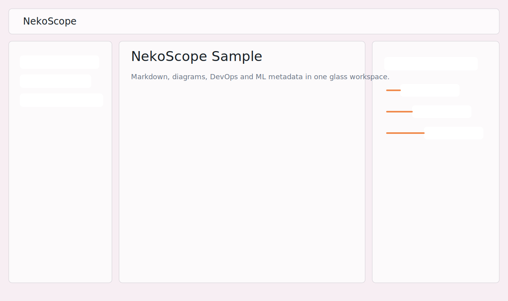

# NekoScope

[](https://github.com/nekoscope/nekoscope/actions/workflows/ci.yml)

A fast, calm desktop **Markdown viewer**.

Double-click a `.md` file and NekoScope opens it instantly — rendered, with an
outline and the rest of the folder one click away. It is a lightweight Tauri 2
desktop app: no accounts, no network calls, no telemetry.



## Features

- **Open from the desktop.** Double-click, "Open with", drag-and-drop onto the
  window, or pass a path on the command line. A second double-click focuses the
  window that is already open instead of starting a new one.
- **Rich rendering.** GitHub-Flavored Markdown (tables, task lists,
  strikethrough), frontmatter, KaTeX math, inline Mermaid diagrams (themed for
  light and dark), syntax-highlighted code fences with copy buttons.
- **Navigation.** File sidebar, document outline, quick switcher
  (`Ctrl/Cmd+P`), command palette (`Ctrl/Cmd+K`), and full-text folder search
  (`Ctrl/Cmd+F`) that jumps to the matching line.
- **Reading comfort.** Rendered / Source / Split views, Zen mode, light / dark /
  system theme, adjustable font size.
- **Live reload.** Edit a file in your editor and the view refreshes itself.
- **Stays out of the way.** Relative links between documents open in place; the
  toolbar can open the file in your default editor or reveal it in the file
  manager.
- **Languages.** English, Russian, Japanese and Chinese, picked from your
  system locale by default.

## Open `.md` from the desktop

The installer registers NekoScope as a handler for `.md`, `.markdown` and `.mdx`
files. On Windows and Linux the opened file is delivered as a launch argument; on
macOS it arrives through the system "open file" event. Either way the file is
shown immediately and its folder is loaded into the sidebar so you can browse
sibling documents.

## Supported files

Markdown is the focus. Any other text file you open from the sidebar (YAML, JSON,
TOML, Dockerfile, Terraform, …) is shown in the syntax-highlighted source view.

## Build from source

```sh
pnpm install
pnpm verify
pnpm tauri build
```

The desktop binary does not require Node at runtime.

## Keyboard

| Keys                       | Action                          |
| -------------------------- | ------------------------------- |
| `Ctrl/Cmd + O`             | Open file                       |
| `Ctrl/Cmd + Shift + O`     | Open folder                     |
| `Ctrl/Cmd + P`             | Quick switch file               |
| `Ctrl/Cmd + F`             | Search in folder                |
| `Ctrl/Cmd + K`             | Command palette                 |
| `Ctrl/Cmd + E`             | Cycle rendered / source / split |
| `Ctrl/Cmd + I`             | Toggle outline                  |
| `Ctrl/Cmd + B`             | Toggle file sidebar             |
| `Ctrl/Cmd + J`             | Toggle light / dark             |
| `Ctrl/Cmd + =` / `-` / `0` | Font size up / down / reset     |
| `Ctrl/Cmd + Shift + Z`     | Zen mode                        |
| `Esc`                      | Close dialog / leave Zen mode   |

## Privacy

NekoScope validates file paths against the open folder, sanitizes rendered HTML,
makes no network requests, stores nothing remotely and collects no telemetry.

## Verification

```sh
pnpm verify
```

This runs the frontend checks (lint, format, typecheck, tests, build) and the
Rust checks (`cargo fmt`, `cargo clippy`, `cargo test`).
