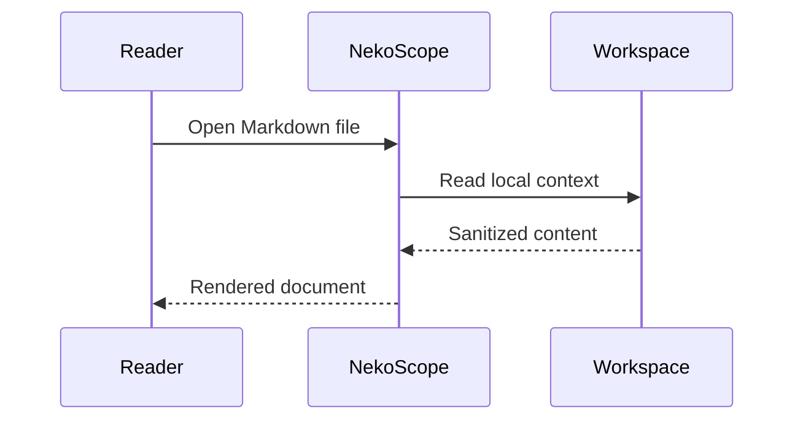
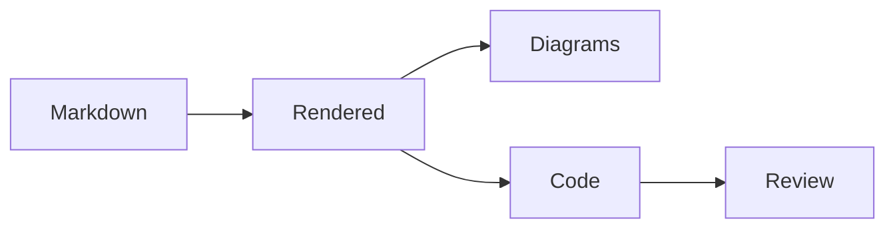
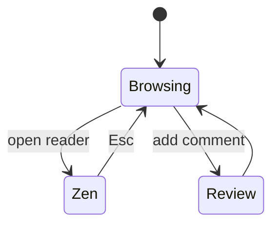
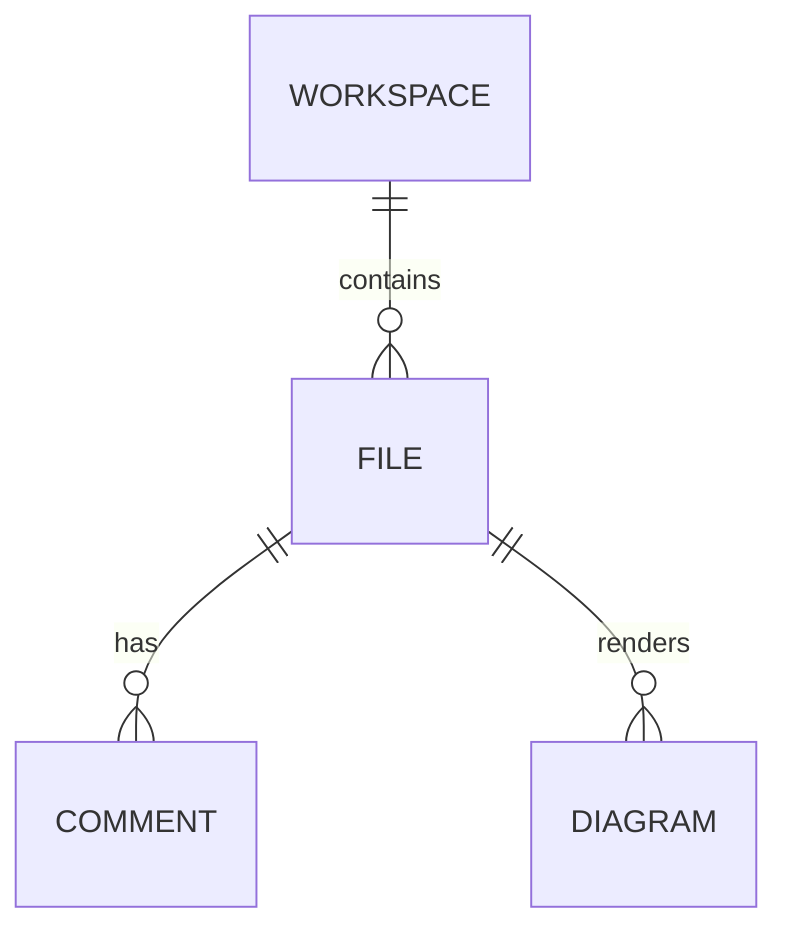
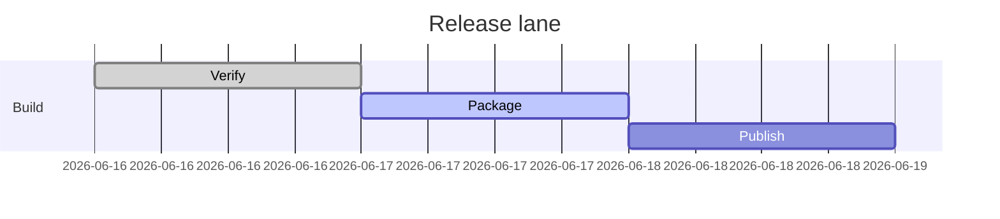
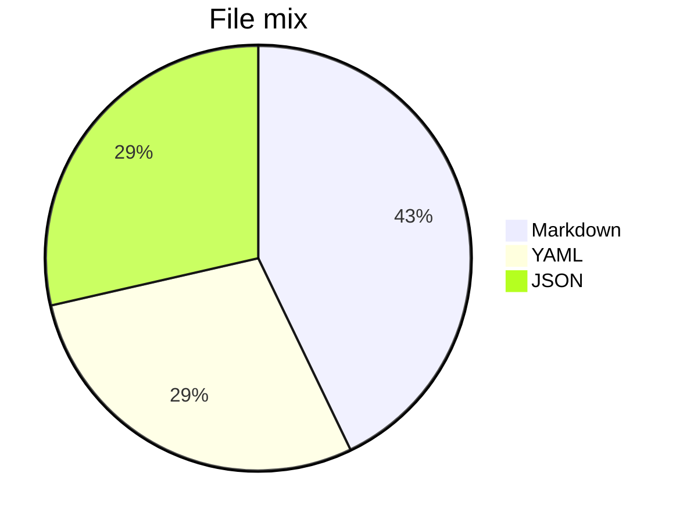

# NekoScope Sample

This workspace exercises Markdown rendering, [architecture notes](docs/architecture.md), inline diagrams, DevOps manifest highlighting, ML metadata and review comments.

## Quick tour

- Browse Markdown, YAML, Terraform and ML files.
- Use Zen mode when you only want to read.
- Open comments and AI as supporting tools instead of permanent sidebars.

## DevOps manifest preview

```kubernetes
apiVersion: apps/v1
kind: Deployment
metadata:
  name: nekoscope
  namespace: docs
  labels:
    app.kubernetes.io/name: nekoscope
spec:
  replicas: 2
  template:
    spec:
      containers:
        - name: app
          image: ghcr.io/ducheved/nekoscope:0.1.0
          resources:
            requests:
              cpu: 50m
              memory: 128Mi
```

## Diagram gallery













| Area      | Renderer          | Status      |
| --------- | ----------------- | ----------- |
| Markdown  | GFM + math        | stable      |
| Mermaid   | inline SVG        | themed      |
| Manifests | DevOps-aware code | highlighted |
