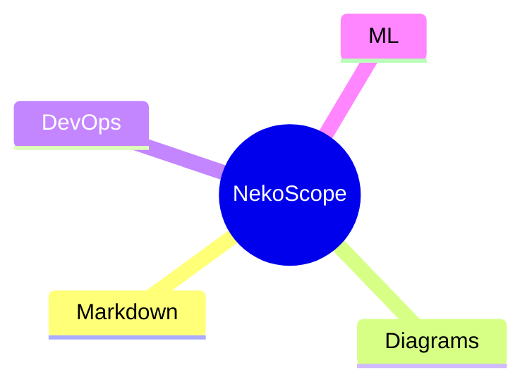

# NekoScope Sample

This workspace exercises Markdown rendering, [[docs/architecture]], diagrams, DevOps summaries, ML metadata and review comments.

## Quick Tour

- Browse Markdown, YAML, Terraform and ML files.
- Open the mindmap panel from document headings.
- Inspect Kubernetes and GitHub Actions summaries.

