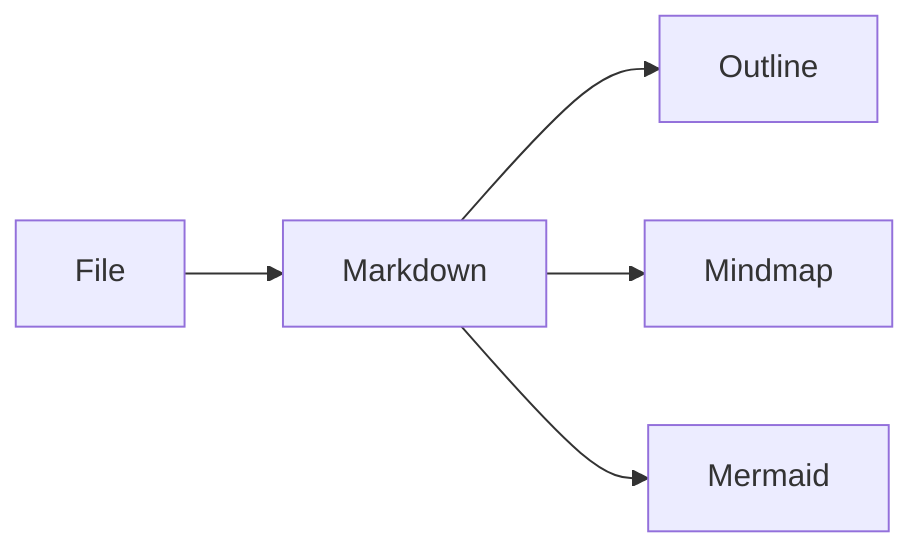

# Architecture

NekoScope uses a Tauri desktop shell, a Rust command boundary and a Svelte interface.

## Renderer Registry

## Privacy Boundary

AI context is redacted before requests are prepared, and rendered documents do not perform remote network calls by default.
